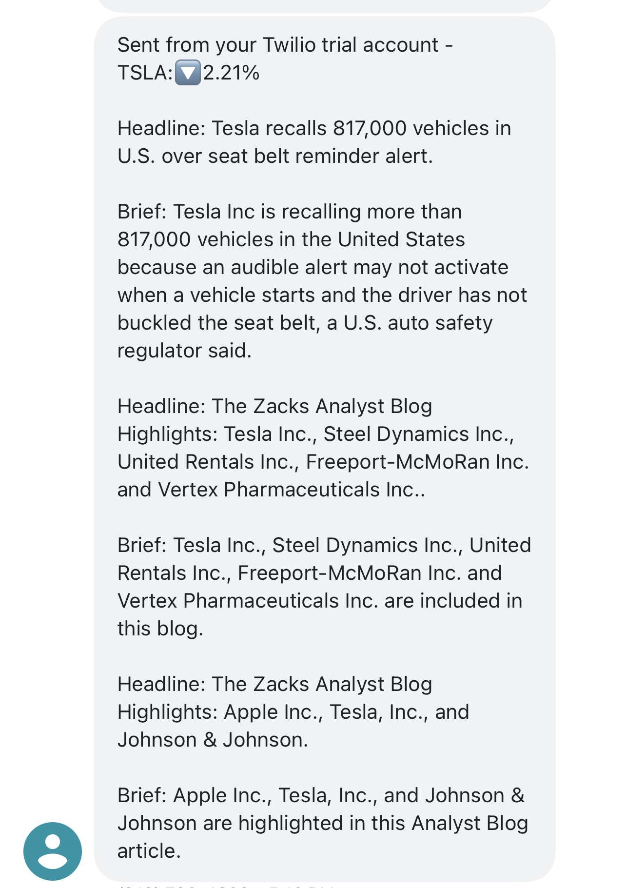

# Stock News Alert

A powerful solution for stock enthusiasts. Stock News Alert programs allows the user to set up an alert via SMS everytime
a percent difference occurs between two closing days. The program can be preconfigured to track any stock. Currently 
the program is preconfigured for TSLA. The variable can be changed and modified.


## Features

- Fully automatic script.

- Low memory usage.

- Cross-platform.

- SMS preconfigured, uses Twilio API.

- Uses NewsAPI.org for generating recent articles.

- Alpha Vantage for Stock API info.


## Authors

- [@sanduler](https://github.com/sanduler)

### Built With

- [Python3](https://www.python.org/)

<p align="right">(<a href="#top">back to top</a>)</p>

<!-- GETTING STARTED -->

## Getting Started

This is an example of how you may give instructions on setting up your project locally.
To get a local copy up and running follow these simple example steps.

### Prerequisites

This is an example of how to list things you need to use the software and how to install them.

- npm
  ```sh
  npm install npm@latest -g
  ```

### Installation

1. Clone the repo
   ```sh
   git clone https://github.com/sanduler/stock-news-alert
   ```
2. Install NPM packages
   ```sh
   npm install twilio.rest
   ```
3. Install NPM packages
   ```sh
   npm install requests
   ```
4. Get theStock API
   ```sh
   https://www.alphavantage.co
   ```
5. Get the NewsAPI
    ```sh
   https://newsapi.org
   ```
6. Get the Twilio API
   ```sh
   https://www.twilio.com
   ```

<p align="right">(<a href="#top">back to top</a>)</p>


## Screenshots


--------------------------------

## License

[MIT](https://choosealicense.com/licenses/mit/)

